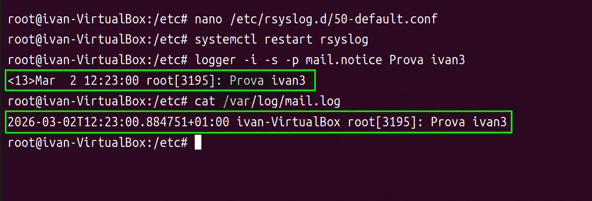

<!DOCTYPE html>
<html lang="es">
<head>
    <meta charset="UTF-8">
    <meta name="viewport" content="width=device-width, initial-scale=1.0">
    <title>Sprint 5. Logs y monitorización</title>

    <link rel="stylesheet" href="https://cdnjs.cloudflare.com/ajax/libs/font-awesome/6.5.0/css/all.min.css">

    
</head>

<body>

<main class="contenedor-principal">

    

        <h1>Sprint 5. Logs y monitorización</h1>

        <h2>Servidor de actualizaciones Ubuntu (CDN)</h2>

        

        Empezamos instalando el <code>apache2</code> 
        img/1
        

        

            
        

        

        Después instalamos el <code>apt-mirror</code> 
        img/2
        

        

            
        

        

        En este archivo ponemos los repositorios que el servidor debe descargar 
        img/3
        

        

            
        

        

        Descomentamos las repos y dejamos solo la de Chrome para ganar tiempo 
        img/4
        

        

            
        

        

        Ejecutamos <code>apt-mirror</code> para descargar los paquetes del repositorio 
        img/5
        

        

            
        

        

        Configuramos Apache 
        img/6
        

        

            
        

        

        Creamos el <strong>softlink</strong> 
        img/7
        

        

            
        

        

        Uso de repositorios externos para paquetes específicos como <em>antigravity</em> 
        img/8
        

        

            
        

    

    

        <h2>Repositorio nuevo para Google Chrome</h2>

        

        Para descargar Google Chrome desde un repositorio externo, añadimos la clave y configuramos el repositorio oficial en el sistema.
        

        
sudo mkdir -p /etc/apt/keyrings
wget -q -O - https://dl.google.com/linux/linux_signing_key.pub | sudo gpg --dearmor -o /etc/apt/keyrings/google-chrome.gpg

        

        Después añadimos el repositorio de Chrome al archivo de fuentes de APT.
        

        
echo "deb [arch=amd64 signed-by=/etc/apt/keyrings/google-chrome.gpg] http://dl.google.com/linux/chrome/deb/ stable main" | sudo tee /etc/apt/sources.list.d/google-chrome.list

        

        Actualizamos la lista de paquetes e instalamos Chrome.
        

        
sudo apt update
sudo apt install google-chrome-stable

        

        En el servidor con <code>apt-mirror</code>, este repositorio permite descargar los paquetes de Chrome para servirlos desde la máquina configurada como repositorio local.
        

        
deb http://dl.google.com/linux/chrome/deb/ stable main
clean http://dl.google.com/linux/chrome/deb/

    

    

        <h2>Configurar el cliente</h2>

        

        Abrimos el archivo de repositorios del cliente.
        

        
nano /etc/apt/sources.list

        

        Sources.list del cliente 
        img/9
        

        

            
        

        

        Como Google Chrome requiere firma, importamos su clave pública.
        

        

        Error de firma antes de importar la clave 
        img/10
        

        

            
        

        

        Después ejecutamos <code>apt update</code> para comprobar que el cliente obtiene paquetes desde el servidor local 
        img/11
        

        

            
        

        

        Instalamos el paquete desde el servidor.
        

        
apt install google-chrome-stable

        

        Instalación de Google Chrome desde el servidor local 
        img/12
        

        

            
        

        

        Google Chrome queda instalado correctamente 
        img/13
        

        

            
        

    

</main>

</body>
</html>
