<link rel="stylesheet" href="{{ '/assets/css/style.css' | relative_url }}">

<main class="contenedor-principal">

<h1>Sprint 5. Logs y monitorización</h1>

<h2>Conceptos fundamentales de logging</h2>

Para gestionar los logs, Linux utiliza dos conceptos principales para clasificar la información.

<strong>Facility:</strong> define el origen o tipo de programa que genera el mensaje.

<strong>Priority:</strong> define la gravedad del mensaje.

Con punto <code>.</code> indicamos ese nivel y todos los superiores.
Con <code>.=</code> indicamos únicamente ese nivel exacto.

<h2>La herramienta logger</h2>

El comando <code>logger</code> permite añadir entradas manuales al log del sistema desde terminal.

logger -i -s -p mail.err "Mensaje de error"

La opción <code>-i</code> añade el PID del proceso,
<code>-s</code> muestra el mensaje también por stderr y
<code>-p</code> especifica la facility y la priority.

<h2>Rotación de logs con logrotate</h2>

Acceso al directorio de configuración. 
img/15

    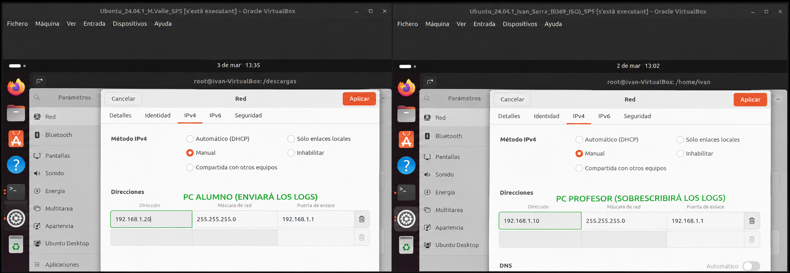

Configuración de rsyslog para logrotate. 
img/16

    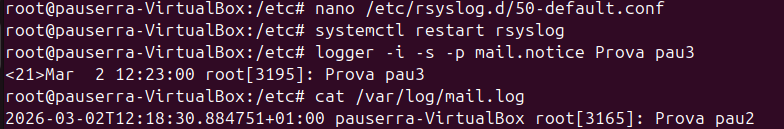

<h2>Configuración de rsyslog</h2>

Archivo principal de configuración. 
img/17

    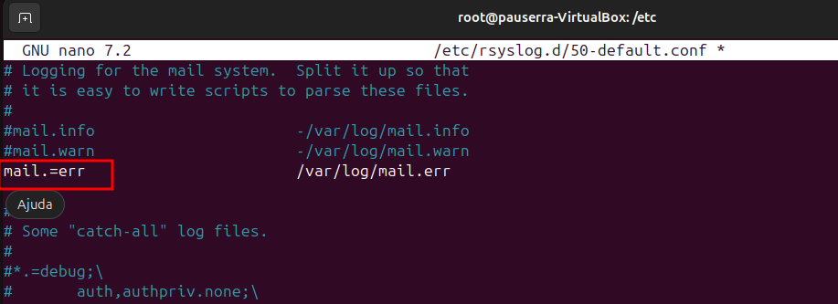

Prueba con <code>kern.notice</code>. 
img/18

    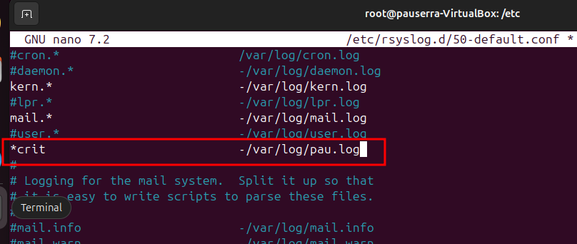

Prueba con <code>mail.notice</code>. 
img/19

    

Filtrado de niveles específicos. 
img/20

    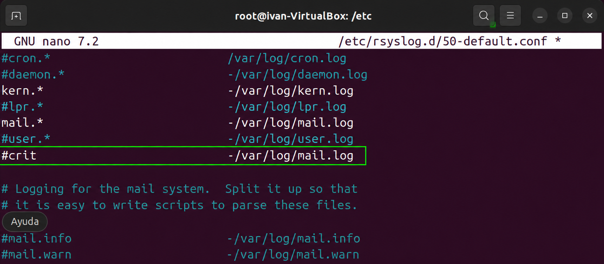

Configuración de logs personalizados. 
img/21

    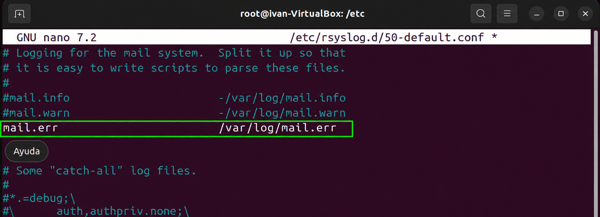

<h2>journalctl</h2>

Los sistemas modernos utilizan <code>journalctl</code> para consultar logs binarios gestionados por systemd.

journalctl --facility=mail

Consulta de logs mediante journalctl. 
img/22

    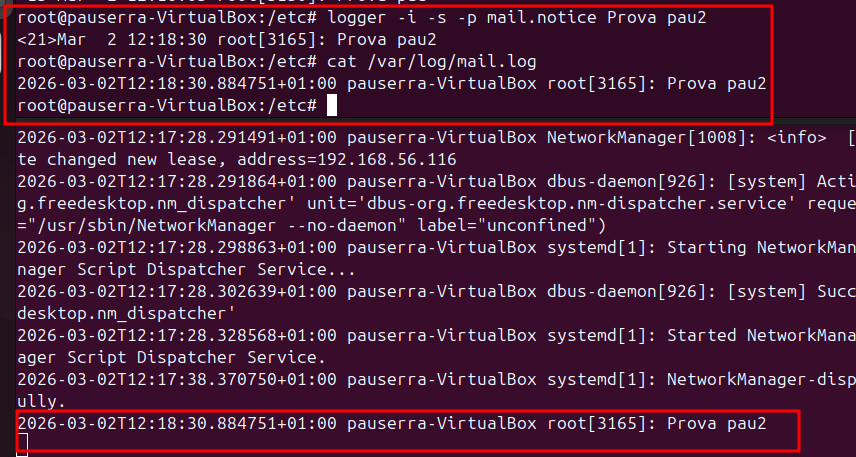

<h2>Centralización de logs con rsyslog</h2>

Configuración IP de las máquinas. 
img/23

    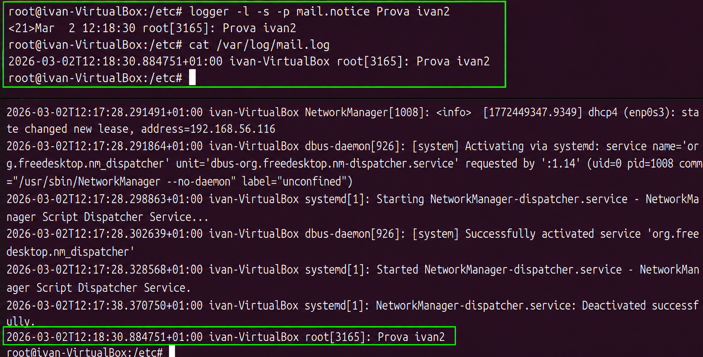

Comprobación de IPs con <code>ip a</code>. 
img/24

    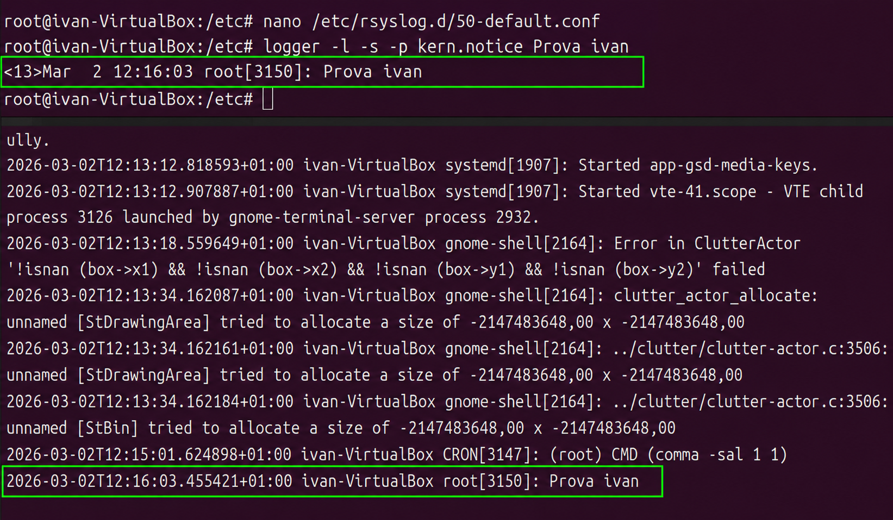

Instalación de rsyslog. 
img/25

    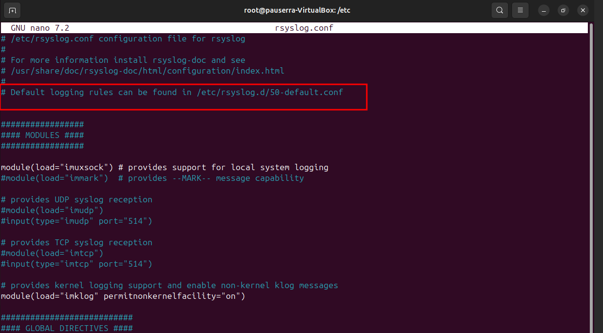

Activación de recepción UDP en el servidor. 
img/26

    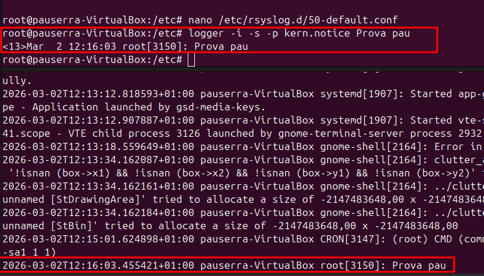

Reinicio del servicio rsyslog. 
img/27

    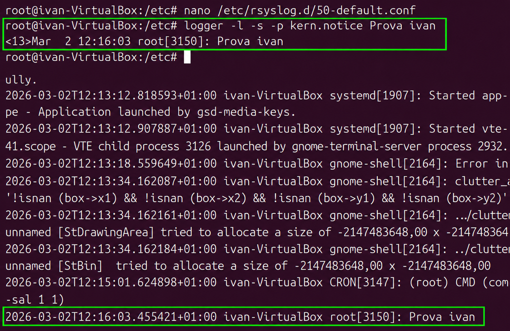

Configuración del cliente para enviar logs al servidor. 
img/28

    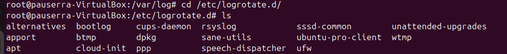

Recepción correcta de logs. 
img/29

    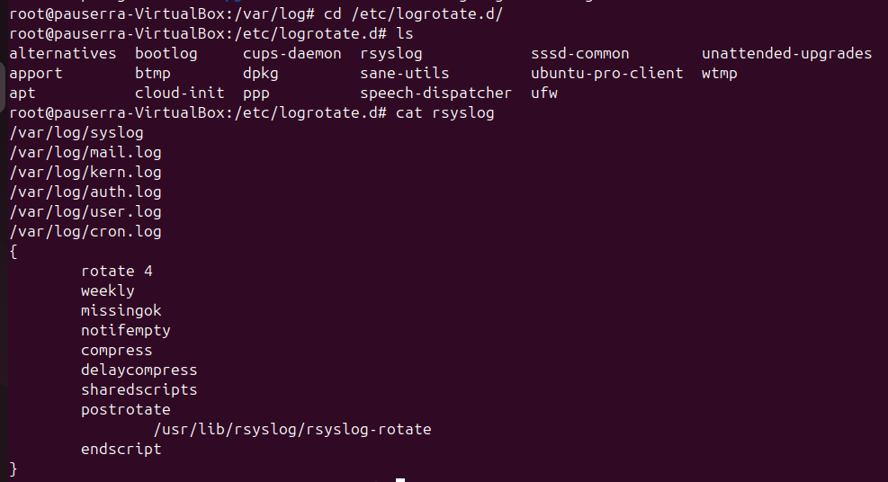

<h2>Servidor de actualizaciones Ubuntu (CDN)</h2>

Instalación de Apache2. 
img/1

    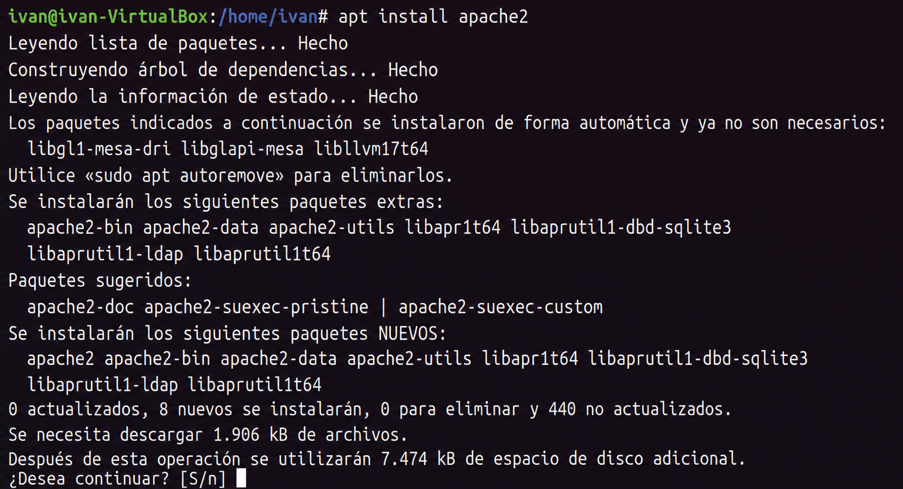

Instalación de apt-mirror. 
img/2

    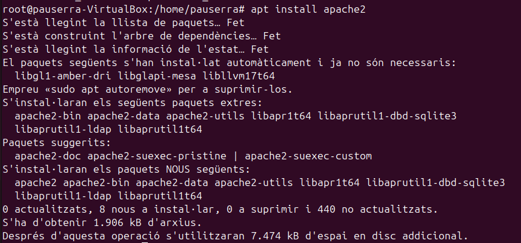

Configuración de mirror.list. 
img/3

    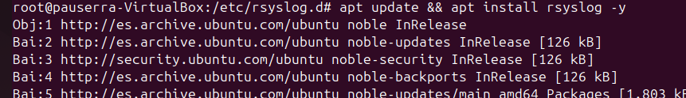

Repositorios activos. 
img/4

    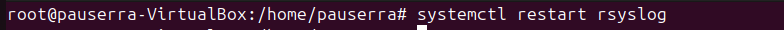

Ejecución de apt-mirror. 
img/5

    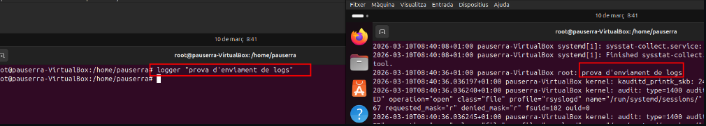

Configuración Apache. 
img/6

    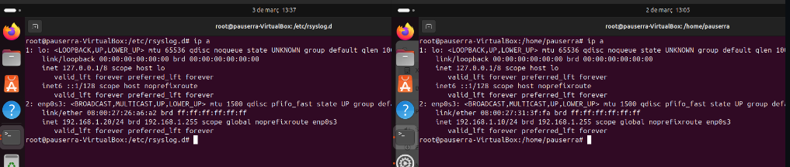

Softlink creado. 
img/7

    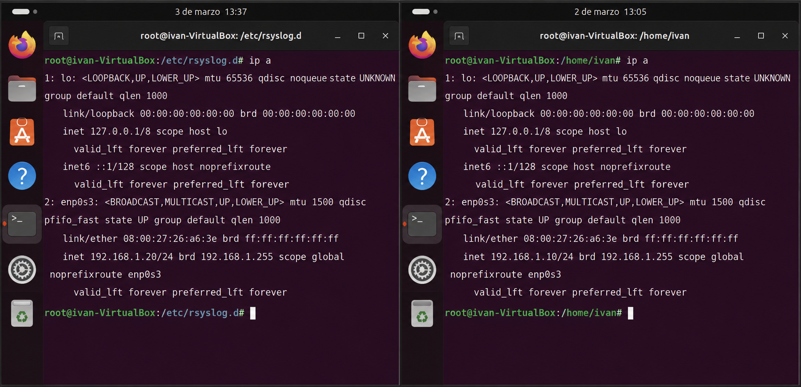

Repositorio externo antigravity. 
img/8

    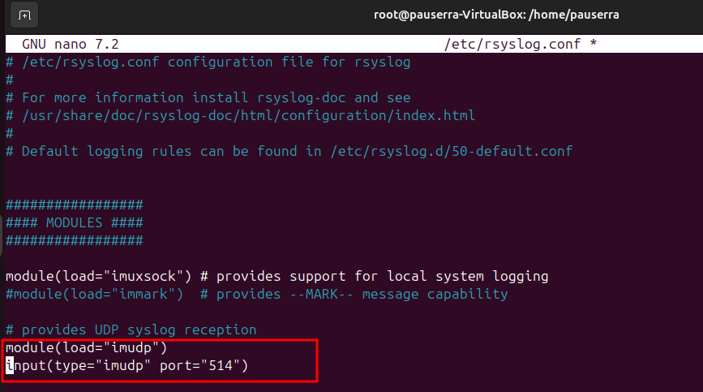

<h2>Configurar el cliente</h2>

nano /etc/apt/sources.list

Sources.list del cliente. 
img/9

    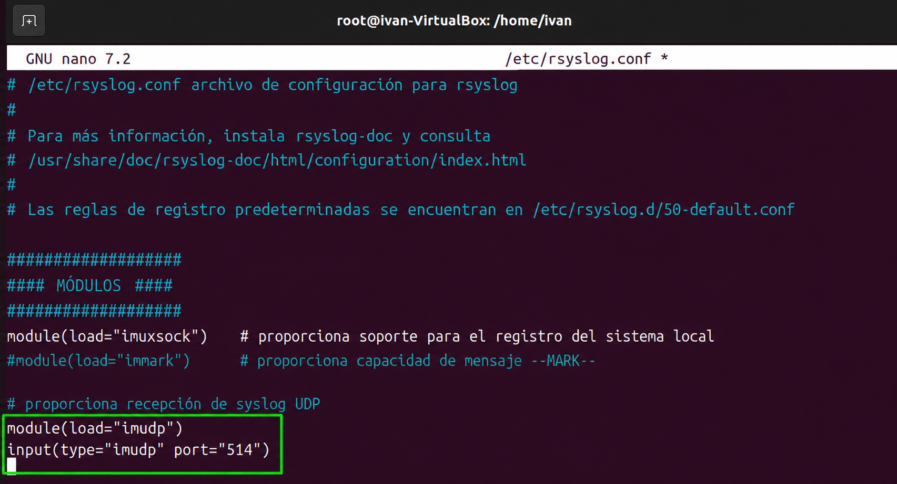

Error GPG antes de importar la clave. 
img/10

    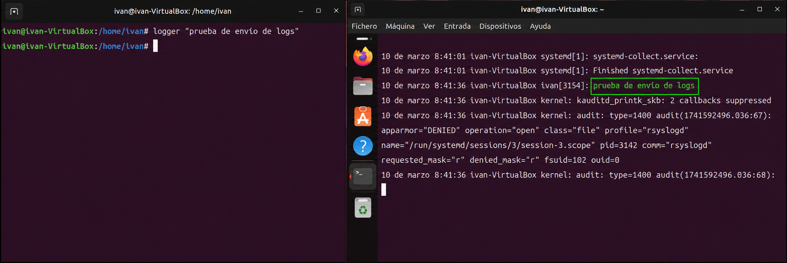

Instalación de rsyslog en el cliente. 
img/11

    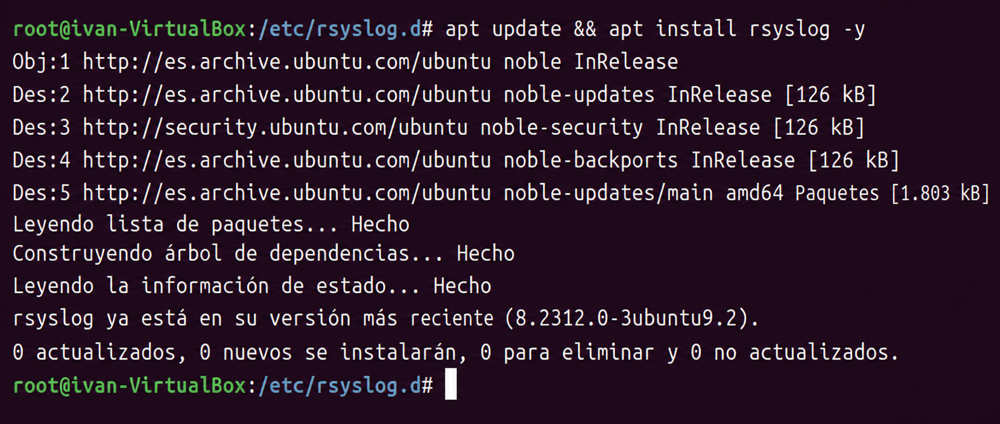

apt install google-chrome-stable

Instalación de Google Chrome desde el servidor local. 
img/12

    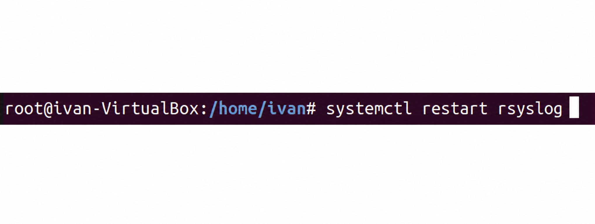

Google Chrome instalado correctamente.

    

</main>
